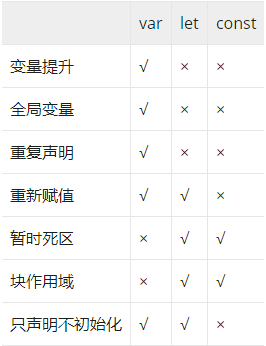

# 介绍
ECMAScript是一种由Ecma国际（前身为欧洲计算机制造商协会）在标准ECMA-262中定义的脚本语言规范。这种语言在万维网上应用广泛，它往往被称为JavaScript或JScript，但实际上后两者是ECMA-262标准的实现和扩展。
# 历史版本
主要的几个历史版本如下：
1. 2015年6月：ECMAScript 2015（ES2015），第 6 版，最早被称作是 ECMAScript 6（ES6），添加了类和模块的语法，其他特性包括迭代器，Python风格的生成器和生成器表达式，箭头函数，二进制数据，静态类型数组，集合（maps，sets 和 weak maps），promise，reflection 和 proxies。作为最早的 ECMAScript Harmony 版本，也被叫做ES6 Harmony。
2. 2016年6月：ECMAScript 2016（ES2016），第 7 版，多个新的概念和语言特性。
3. 2017年6月：ECMAScript 2017（ES2017），第 8 版，多个新的概念和语言特性。
4. 2018年6月：ECMAScript 2018 （ES2018），第 9 版，包含了异步循环，生成器，新的正则表达式特性和 rest/spread 语法。
5. 2019年6月：ECMAScript 2019 （ES2019），第 10 版。
# 主要特性
## ES6(ES2015)
1. let和const
  
在ES6以前，JS只有var一种声明方式，但是在ES6之后，就多了let跟const这两种方式。用var定义的变量没有块级作用域的概念，而let跟const则会有，因为这三个关键字创建是不一样的。[example](./js/var_let_const.js)

  
2. 类（class）
  
写法进行了更改，在ES6之前，如果我们要生成一个实例对象，传统的方法就是写一个构造函数，通过构造函数去绑定方法；但是在ES6之后，我们可以通过类的形式直接书写，[例子如下](./js/class.js)：

  构造函数  

    function Person(name, age) {
      this.name = name
      this.age = age
    }
    Person.prototype.information = function () {
      return 'My name is ' + this.name + ', I am ' + this.age
    }

  类  
  
    class Person {
      constructor(name, age) {
        this.name = name;
        this.age = age;
      }

      information() {
        return `My name is ${this.name}, I am ${this.age}`;
      }
    }

    let person = new Person('珂', 18);

3. 箭头函数
箭头函数表达式的语法比函数表达式更简洁，并且没有自己的this，arguments，super或 new.target。这些函数表达式更适用于那些本来需要匿名函数的地方，并且它们不能用作构造函数。[code](./js/arrow_function.js)

        let list = [1, 2, 3, 4, 5, 6, 7];
        let newList = list.map(function (item) {
          return item * item;
        })

        // es6
        const arr = [1, 2, 3, 4, 5, 6, 7];
        const newArr = list.map(item => item * item);
  
4. 函数参数默认值
定义函数时可给参数设置默认值[example](./js/function_defaults.js) 
 
        function config (data = 'data is empty') {
          return data;
        } 
5. 模板字符串
主要是拼接字符串的问题，不用再使用+进行字符串与变量值的拼接，而是直接使用``${}``来展示
  
        let name = '拼接字符串';
        let age = 20;
        const info = `My name is ${name}, I am ${age}`;
  
6. 解构赋值
通过解构赋值，可以将属性/值从这个对象/数组中取出，赋值给其他变量[example](./js/destructuring.js)
  
        let a = 10;
        let b = 20;
        [a, b] = [b, a];
  
7. 模块化
es6之前js并没有模块化的概念，有的也只是社区定制的类似的CommonJS和AMD之类的规则，通过exports可导出模块。[example](./js/module.js)es6之后可通过export导出模块，不过该方式必须在script的type=module类型下面才可以正确执行。[example](./js/module.html)
8. [扩展操作符](./js/spread_operator.js)
扩展操作符可以在函数调用/数组构造时，将数组表达式或者string在语法层面展开；还可以在构造字面量对象时，将对象表达式按key-value的方式展开。
9. Promise
Promise 是ES6提供的一种异步解决方案，比回调函数更加清晰明了。共有三种状态:
    1. 等待中（pending）
    2. 完成（resolved）
    3. 拒绝（rejected）
一旦从等待状态变成为其他状态就永远不能更改状态了，也就是说一旦状态变为 resolved 后，就不能再次改变
  
            new Promise((resolve, reject) => {
              resolve('success')
              // 无效
              reject('reject')
            })
  
  当我们在构造Promise的时候，构造函数内部的代码是立即执行的
  
    new Promise((resolve, reject) => {
      resolve('success');
    })
    console.log('finish');  
  
  Promise实现了链式调用，也就是说每次调用then之后返回的都是一个Promise，并且是一个全新的Promise，原因也是因为状态不可变。如果你在then中 使用了return，那么return的值会被Promise.resolve()包装
  
    Promise.resolve(1)
    .then(res => {
      console.log(res) // => 1
      return 2 // 包装成 Promise.resolve(2)
    })
    .then(res => {
      console.log(res) // => 2
    })
10. for...of
for...of语句在可迭代对象（包括 Array，Map，Set，String，TypedArray，arguments 对象等等）上创建一个迭代循环，调用自定义迭代钩子，并为每个不同属性的值执行语句。

        const array = ['a', 'b', 'c'];
        for (const element of array) {
          console.log(element);
        }
11. Symbol
symbol 是一种基本数据类型，Symbol()函数会返回symbol类型的值，该类型具有静态属性和静态方法。它的静态属性会暴露几个内建的成员对象；它的静态方法会暴露全局的symbol注册，且类似于内建对象类，但作为构造函数来说它并不完整，因为它不支持语法："new Symbol()"。每个从Symbol()返回的symbol值都是唯一的。一个symbol值能作为对象属性的标识符；这是该数据类型仅有的目的。[example](./js/symbol.js)
12. 迭代器/生成器
迭代器（Iterator）是一种迭代的机制，为各种不同的数据结构提供统一的访问机制。任何数据结构只要内部有 Iterator 接口，就可以完成依次迭代操作。

一旦创建，迭代器对象可以通过重复调用next()显式地迭代，从而获取该对象每一级的值，直到迭代完，返回{ value: undefined, done: true };

虽然自定义的迭代器是一个有用的工具，但由于需要显式地维护其内部状态，因此需要谨慎地创建。生成器函数提供了一个强大的选择：它允许你定义一个包含自有迭代算法的函数， 同时它可以自动维护自己的状态。 生成器函数使用 function*语法编写。 最初调用时，生成器函数不执行任何代码，而是返回一种称为Generator的迭代器。 通过调用生成器的下一个方法消耗值时，Generator函数将执行，直到遇到yield关键字。

可以根据需要多次调用该函数，并且每次都返回一个新的Generator，但每个Generator只能迭代一次。

    function* makeRangeIterator(start = 0, end = Infinity, step = 1) {
        for (let i = start; i < end; i += step) {
            yield i;
        }
    }
    var a = makeRangeIterator(1,10,2)
    a.next() // {value: 1, done: false}
    a.next() // {value: 3, done: false}
    a.next() // {value: 5, done: false}
    a.next() // {value: 7, done: false}
    a.next() // {value: 9, done: false}
    a.next() // {value: undefined, done: true}
13. Set/WeakSet
Set 对象允许你存储任何类型的唯一值，无论是原始值或者是对象引用。所以我们可以通过Set实现数组去重

        const numbers = [2,3,4,4,2,3,3,4,4,5,5,6,6,7,5,32,3,4,5];
        console.log([...new Set(numbers)]); // [2, 3, 4, 5, 6, 7, 32]

WeakSet 结构与 Set 类似，但区别有以下两点:
1. WeakSet 对象中只能存放对象引用, 不能存放值, 而 Set 对象都可以。
2. WeakSet 对象中存储的对象值都是被弱引用的, 如果没有其他的变量或属性引用这个对象值, 则这个对象值会被当成垃圾回收掉. 正因为这样, WeakSet 对象是无法被枚举的, 没有办法拿到它包含的所有元素。

        var ws = new WeakSet();
        var obj = {};
        var foo = {};

        ws.add(window);
        ws.add(obj);

        ws.has(window); // true
        ws.has(foo);    // false, 对象 foo 并没有被添加进 ws 中 

        ws.delete(window); // 从集合中删除 window 对象
        ws.has(window);    // false, window 对象已经被删除了

        ws.clear(); // 清空整个 WeakSet 对象
14. Map/WeakMap
  
Map 对象保存键值对。任何值(对象或者原始值) 都可以作为一个键或一个值。

  var myMap = new Map();
  myMap.set(NaN, "not a number");

  myMap.get(NaN); // "not a number"

  var otherNaN = Number("foo");
  myMap.get(otherNaN); // "not a number"

WeakMap 对象是一组键/值对的集合，其中的键是弱引用的。其键必须是对象，而值可以是任意的。

    var wm1 = new WeakMap(),
        wm2 = new WeakMap(),
        wm3 = new WeakMap();
    var o1 = {},
        o2 = function(){},
        o3 = window;

    wm1.set(o1, 37);
    wm1.set(o2, "azerty");
    wm2.set(o1, o2); // value可以是任意值,包括一个对象
    wm2.set(o3, undefined);
    wm2.set(wm1, wm2); // 键和值可以是任意对象,甚至另外一个WeakMap对象
    wm1.get(o2); // "azerty"
    wm2.get(o2); // undefined,wm2中没有o2这个键
    wm2.get(o3); // undefined,值就是undefined

    wm1.has(o2); // true
    wm2.has(o2); // false
    wm2.has(o3); // true (即使值是undefined)

    wm3.set(o1, 37);
    wm3.get(o1); // 37
    wm3.clear();
    wm3.get(o1); // undefined,wm3已被清空
    wm1.has(o1);   // true
    wm1.delete(o1);
    wm1.has(o1);   // false
15. Proxy/Reflect
Proxy 对象用于定义基本操作的自定义行为（如属性查找，赋值，枚举，函数调用等）。
Reflect 是一个内置的对象，它提供拦截 JavaScript 操作的方法。这些方法与 Proxy 的方法相同。Reflect不是一个函数对象，因此它是不可构造的。

        const observe = (data, callback) => {
            return new Proxy(data, {
                get(target, key) {
                    return Reflect.get(target, key)
                },
                set(target, key, value, proxy) {
                    callback(key, value);
                    target[key] = value;
                    return Reflect.set(target, key, value, proxy) 
                }
            })
        }

        const FooBar = { open: false };
        const FooBarObserver = observe(FooBar, (property, value) => {
          property === 'open' && value 
              ? console.log('FooBar is open!!!') 
              : console.log('keep waiting');
        });
        console.log(FooBarObserver.open) // false
        FooBarObserver.open = true // FooBar is open!!!

16. Math对象的扩展
  - `Number.EPSILON`: 数值最小精度 
  
  - `Number.MIN_SAFE_INTEGER`: 最小安全数值(-2^53) 
  
  - `Number.MAX_SAFE_INTEGER`: 最大安全数值(2^53)
  
  - `Number.parseInt()`: 返回转换值的整数部分
  
  - `Number.parseFloat()`: 返回转换值的浮点数部分
  
  - `Number.isFinite()`: 是否为有限数值
  
  - `Number.isNaN()`: 是否为NaN
  
  - `Number.isInteger()`: 是否为整数
  
  - `Number.isSafeInteger()`: 是否在数值安全范围内
  
  - `Math.trunc()`: 返回数值整数部分
  
  - `Math.sign()`: 返回数值类型(正数1、负数-1、零0)
  
  - `Math.cbrt()`: 返回数值立方根
  
  - `Math.clz32()`: 返回数值的32位无符号整数形式
  
  - `Math.imul()`: 返回两个数值相乘
  
  - `Math.fround()`: 返回数值的32位单精度浮点数形式
  
  - `Math.hypot()`: 返回所有数值平方和的平方根
  
  - `Math.expm1()`: 返回e^n - 1
  
  - `Math.log1p()`: 返回1 + n的自然对数(Math.log(1 + n))
  
  - `Math.log10()`: 返回以10为底的n的对数
  
  - `Math.log2()`: 返回以2为底的n的对数
  
  - `Math.sinh()`: 返回n的双曲正弦
  
  - `Math.cosh()`: 返回n的双曲余弦
  
  - `Math.tanh()`: 返回n的双曲正切
  
  - `Math.asinh()`: 返回n的反双曲正弦
  
  - `Math.acosh()`: 返回n的反双曲余弦
  
  - `Math.atanh()`: 返回n的反双曲正切

17. Array对象的扩展 

  - `Array.prototype.from`: 转换具有Iterator接口的数据结构为真正数组，返回新数组

        console.log(Array.from('foo')) // ["f", "o", "o"]
        
  - `Array.prototype.of()`: 转换一组值为真正数组，返回新数组
        
        Array.of(1, 2, 3) // [1, 2, 3]
  - `Array.prototype.copyWithin()`: 把指定位置的成员复制到其他位置，返回原数组

        const array1 = ['a', 'b', 'c', 'd', 'e'];
        console.log(array1.copyWithin(0, 3, 4)); // ["d", "b", "c", "d", "e"]
  - `Array.prototype.find()`: 返回第一个符合条件的成员

        const array1 = [5, 12, 8, 130, 44];
        const found = array1.find(element => element > 10);
        console.log(found); // 12
  - `Array.prototype.findIndex()`: 返回第一个符合条件的成员索引值

        const array1 = [5, 12, 8, 130, 44];
        const isLargeNumber = (element) => element > 13;
        console.log(array1.findIndex(isLargeNumber)); // 3
  - `Array.prototype.fill()`: 根据指定值填充整个数组，返回原数组

        const array1 = [1, 2, 3, 4];
        console.log(array1.fill(0, 2, 4)); // [1, 2, 0, 0]
  - `Array.prototype.keys()`: 返回以索引值为遍历器的对象

        const array1 = ['a', 'b', 'c'];
        const iterator = array1.keys();
        for (const key of iterator) {
          console.log(key);
        }
        // 0
        // 1
        // 2
        
  - `Array.prototype.values()`: 返回以属性值为遍历器的对象

        const array1 = ['a', 'b', 'c'];
        const iterator = array1.values();

        for (const key of iterator) {
          console.log(key);
        }
        // a
        // b
        // c
        
  - `Array.prototype.entries()`: 返回以索引值和属性值为遍历器的对象

        const array1 = ['a', 'b', 'c'];
        const iterator = array1.entries();

        console.log(iterator.next().value); // [0, "a"]
        console.log(iterator.next().value); // [1, "b"]
        
  - `数组空位`: ES6明确将数组空位转为undefined或者empty

        Array.from(['a',,'b']) // [ "a", undefined, "b" ]
        [...['a',,'b']] // [ "a", undefined, "b" ]
        Array(3) //  [empty × 3]
        [,'a'] // [empty, "a"]

## ES7(ES2016)
1. `Array.prototype.includes()` 
`includes()`方法用来判断一个数组是否包含一个指定的值，根据情况，如果包含则返回 true，否则返回false。

        const array1 = [1, 2, 3]
        console.log(array1.includes(2)) // true
2. 幂运算符**
幂运算符**，具有与Math.pow()一样的功能

        console.log(2**10) // 1024
        console.log(Math.pow(2, 10)) // 1024
      
## ES8(ES2017)
1. async/await
虽然Promise可以解决回调地狱的问题，但是链式调用太多，则会变成另一种形式的回调地狱 —— 面条地狱，所以在ES8里则出现了Promise的语法糖async/await，专门解决这个问题。

        async function myFetch() {
            let response = await fetch('coffee.jpg');
            let myBlob = await response.blob();
            let objectURL = URL.createObjectURL(myBlob);
            let image = document.createElement('img');
            image.src = objectURL;
            document.body.appendChild(image);
        }
        myFetch();

2. Object.values()
`Object.values()`方法返回一个给定对象自身的所有可枚举属性值的数组，值的顺序与使用for…in循环的顺序相同 ( 区别在于 for-in 循环枚举原型链中的属性 )。

        const object1 = {
            a: 'somestring',
            b: 42,
            c: false
        }
        console.log(Object.values(object1)); // ["somestring", 42, false]

3. Object.entries()
`Object.entries()`方法返回一个给定对象自身可枚举属性的键值对数组，其排列与使用 for…in 循环遍历该对象时返回的顺序一致（区别在于 for-in 循环还会枚举原型链中的属性）。

        const object1 = {
            a: 'somestring',
            b: 42
        }

        for (let [key, value] of Object.entries(object1)) {
            console.log(`${key}: ${value}`);
        }

        // "a: somestring"
        // "b: 42"

4. padStart()
`padStart()` 方法用另一个字符串填充当前字符串(重复，如果需要的话)，以便产生的字符串达到给定的长度。填充从当前字符串的开始(左侧)应用的。

        const str1 = '5';
        console.log(str1.padStart(2, '0')); // "05"
        console.log(str1.padStart(3, '0')); // "005"
5. padEnd()
`padEnd()` 方法会用一个字符串填充当前字符串（如果需要的话则重复填充），返回填充后达到指定长度的字符串。从当前字符串的末尾（右侧）开始填充。

        const str1 = 'Breaded';
        console.log(str1.padEnd(10, '.')); // "Breaded..."
        const str2 = '200';
        console.log(str2.padEnd(5)); // "200  "
6. Object.getOwnPropertyDescriptors()
`Object.getOwnPropertyDescriptors()` 方法用来获取一个对象的所有自身属性的描述符。代码如下
        const object1 = {
          property1: 42
        }

        const descriptors1 = Object.getOwnPropertyDescriptors(object1)

        console.log(descriptors1.property1.writable) // true

        console.log(descriptors1.property1.value) // 42

        // 浅拷贝一个对象
        Object.create(
          Object.getPrototypeOf(obj), 
          Object.getOwnPropertyDescriptors(obj) 
        )

        // 创建子类
        function superclass() {}
        superclass.prototype = {
          // 在这里定义方法和属性
        }
        function subclass() {}
        subclass.prototype = Object.create(superclass.prototype, Object.getOwnPropertyDescriptors({
          // 在这里定义方法和属性
        }))
## ES9(ES2018)
1. for await...of
for await...of 语句会在异步或者同步可迭代对象上创建一个迭代循环，包括 String，Array，Array-like 对象（比如arguments 或者NodeList)，TypedArray，Map， Set和自定义的异步或者同步可迭代对象。其会调用自定义迭代钩子，并为每个不同属性的值执行语句。

        async function* asyncGenerator() {
              var i = 0
              while (i < 3) {
                    yield i++
              }
        }
        (async function() {
              for await (num of asyncGenerator()) {
                    console.log(num)
              }
        })()
        // 0
        // 1
        // 2
2. 对象扩展操作符
ES6中添加了数组的扩展操作符，让我们在操作数组时更加简便，美中不足的是并不支持对象扩展操作符，但是在ES9开始，这一功能也得到了支持。

        var obj1 = { foo: 'bar', x: 42 };
        var obj2 = { foo: 'baz', y: 13 };

        var clonedObj = { ...obj1 };
        // 克隆后的对象: { foo: "bar", x: 42 }

        var mergedObj = { ...obj1, ...obj2 };
        // 合并后的对象: { foo: "baz", x: 42, y: 13 }

    上面便是一个简便的浅拷贝。这里有一点小提示，就是Object.assign() 函数会触发 setters，而展开语法则不会。所以不能替换也不能模拟Object.assign() 。

    如果存在相同的属性名，只有最后一个会生效。
3. Promise.prototype.finally()
finally()方法会返回一个Promise，当promise的状态变更，不管是变成rejected或者fulfilled，最终都会执行finally()的回调。

        fetch(url)
          .then((res) => {
            console.log(res)
          })
          .catch((error) => { 
            console.log(error)
          })
          .finally(() => { 
            console.log('结束')
          })